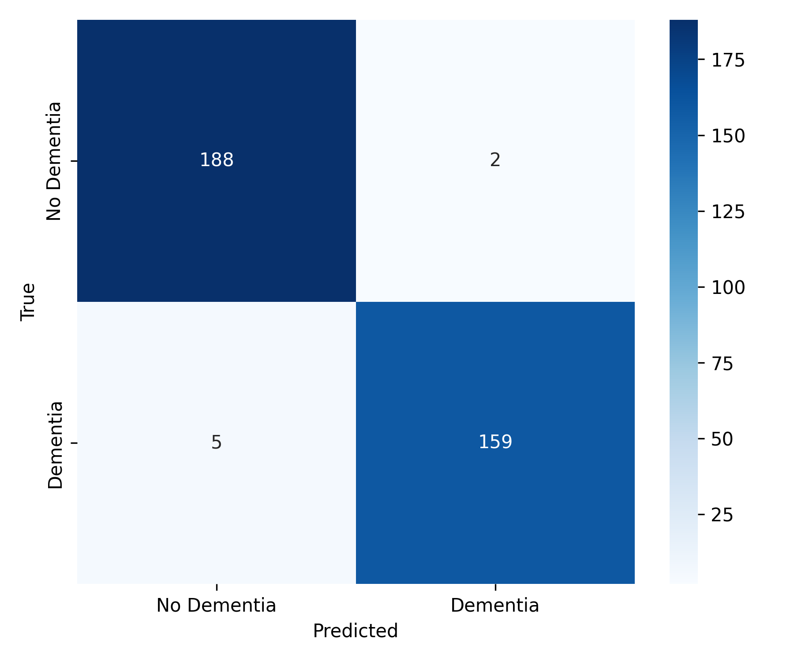

# Dementia Classification MLOps Project

Live Demo: [Hugging Face](https://huggingface.co/spaces/DTanzillo/dementia-ml) | [API Docs](https://dementia-api-822036020986.us-central1.run.app/docs#/default/train_train_post)


## Project Overview and Goals
This repository implements an end to end MLOps workflow for a dementia classification model, including:

- Data ingestion, cleaning, and feature engineering
- Model training and evaluation with logging
- Packaged model artifact
- FastAPI inference service
- Docker containerization
- Cloud deployment with a front end on Hugging Face Spaces

The goal of this project is to ultimately provide a 
tool that can be used to classify whether an 
individual has dementia or not. We realize that our
model requires more information (14 kinds of 
numerical values) than what an average person would 
probably have at hand without visiting a hospital. 
However, we hope, at the very least, that this tool 
serves as motivation for more software developers to 
develop prediction models that can predict whether 
people have dementia or not even with limited 
information so that they can get treatment early and
live better lives as a result.


## Project Structure
_Truncated Tree generated with ChatGPT 5.1 at 4:04 AM 11/25/25 from original `tree -F` call_:

```
.
├── LICENSE
├── README.md                 # Main project documentation

├── app/
│   ├── app.py                # Local FastAPI inference API
│   ├── entrypoint.sh         # Entrypoint for Docker deployments
│   ├── model.pkl             # Model used by local API
│   └── space_app.py          # Gradio/FastAPI app for Hugging Face

├── config/
│   └── config.yaml           # Centralized configuration

├── data/
│   ├── raw/                  # Original dataset
│   └── processed/            # Cleaned + engineered datasets

├── dockerfile                # Dockerfile for local API container

├── docs/
│   └── data_plots/           # EDA figures

├── hugging-face_space/       # Self-contained HF deployment folder
│   ├── Dockerfile
│   ├── README.md
│   ├── requirements.txt
│   └── space_app.py

├── models/
│   ├── checkpoints/          # Intermediate models
│   └── trained/              # Final trained model(s)

├── outputs/
│   ├── logs/                 # Training/inference logs
│   └── results/              # Evaluation outputs (CM, metrics, reports)

├── requirements.txt          # Full pipeline dependencies
├── requirements-api.txt      # Minimal dependencies for API image

└── src/
    ├── data/                 # Cleaning, quality checks, EDA scripts
    ├── models/               # Training/evaluation scripts
    ├── pipeline/             # End-to-end ML pipeline components
    └── utils/                # Logging + visualization utilities
```


## Dataset Description
The source of the data is the **[Kaggle Dementia Prediction Dataset](https://www.kaggle.com/datasets/shashwatwork/dementia-prediction-dataset?utm_source=chatgpt.com)**. This dataset comes directly from the Open Access Series of Imaging Studies (OASIS-2) longitudinal collection of 150 subjects of 373 MRI data. The data collection process was as follows. Each subject was scanned on two or more visits, separated by at least one year for a total of 373 imaging sessions. The dataset includes data on 1-5 individual T1-weighted MRI scans that were taken for each of the subjects (found from inspecting the dataset; the Kaggle dataset description incorrectly states “For each subject, 3 or 4 individual T1-weighted MRI scans obtained in single scan sessions are included”). All subjects are all aged between 60-96 and are right-handed. Therefore, insights gathered from this dataset may not apply to individuals below this age range and/or individuals who are left-handed.

## Cloud Services Used
- **Cloud Storage:** Google Cloud Storage (GCS)
- **Cloud Model Deployment Platform:** Google Cloud Run

## Setup and Usage Instructions

Create and activate a virtual environment, then install dependencies:

```
python -m venv .venv
source .venv/bin/activate # On Windows: .venv\Scripts\activate
pip install --upgrade pip
pip install -r requirements.txt
```

To install only minimal API dependencies:

```
pip install -r requirements-api.txt
```


### Configuration

Global configuration lives in `config/config.yaml`. It defines:

- Data directories
- Model artifact directories
- Logging output paths
- Results directory

Training and evaluation scripts read this configuration.

## Exploratory Data Analysis

Exploratory Data Analysis scripts are in ‘src/data’.

Flow:

1. Assess data structure of dataset:
   ```
   python src/data/assess_data_structure.py
   ```
2. Get descriptive statistics for dataset:
   ```
   python src/data/report_descriptive_statistics.py
   ```
3. Assess data quality of dataset:
   ```
   python src/data/assess_data_quality.py
   ```
4. Explore variable relationships that exist in the dataset (can find a saved version of the generated correlation heatmap in the docs/data_plots folder):
   ```
   python src/data/explore_variable_relationships.py
   ```
5. Generate visualizations for the dataset (can find saved versions of the plots in the docs/data_plots folder):
   ```
   python src/data/visualize_data.py
   ```
6. Perform basic data cleaning on the raw dataset (cleaned version of the raw dataset is saved as “cleaned_dementia_dataset.csv” in the data/processed folder):
   ```
   python src/data/clean_data.py
   ```
## Data Pipeline

Pipeline scripts are in `src/pipeline`:

Flow:

1. Ingest Clean Data via a Google Cloud Storage Bucket or Saved Locally in Repo:
   ```
   python src/pipeline/ingest_data.py
   ```
2. Preprocess Data:
   ```
   python src/pipeline/preprocess_data.py
   ```
3. Feature engineer:
   ```
   python src/pipeline/feature_engineer_data.py
   ``` 
Alternatively, run the orchestrated pipeline which runs through steps 1-3 automatically:
   ```
   python src/pipeline/pipeline.py
   ```

## Model Architecture and Evaluation

Final deployed model is an XGBoost Gradient Boosted Decision Tree Classifier (`XGBClassifier`) trained and engineered on the scaled dementia dataset. XGBoost:

- handles nonlinear interactions between MRI features and cognitive metrics
- performs well on our small medical dataset
- robust to the varying scales

Model was tuned via `RandomizedSearchCV` on `n_estimators` and `max_depth` to avoid overfitting

Final Hyperparameters are specified in `config/config.yaml` as:

```
model:
 type: xgboost
 params:
   xgboost:
     n_estimators: 100
     max_depth: 3
```
### Logging
Both the training pipeline and evaluation pipeline produce structured logs to help track the full lifecycle of the model. All logs are automatically written into:
```
outputs/logs/
```
These logs document loading, test/train split, initializing the model, hyperparameter tuning, which hyperparameters were selected, and saving checkpoint before reporting final validation accuracy.

To run this pipeline within the Python Environment, training (`src/models/train_model.py`) saves:

- `models/checkpoints/xgboost_checkpoint.pkl`
- `models/trained/xgboost_final.pkl`

And evaluation (`src/models/evaluate_model.py`) produces:

- `outputs/results/classification_report.json`
- `outputs/results/evaluation_results.json`
- `outputs/results/cm.png`
- logs under `outputs/logs/`


Example Run:
```
python src/pipeline/train_model.py
python src/pipeline/evaluate_model.py
```

Running the model produces the following confusion matrix achieving:
```
"val_accuracy": 0.9142857142857143
"accuracy": 0.980225988700565
"precision": 0.9808354520001288,
"recall": 0.9794929396662387,
"f1-score": 0.9800923880297249
```


We report accuracy, precision, recall, F1-score, and the confusion matrix because dementia prediction is a clinical classification problem where both false positives and false negatives matter:
- Accuracy (0.98): overall correctness of the model on balanced data.
- Precision (0.981): when the model predicts dementia, it is almost always correct (low false-positive rate).
- Recall (0.979): the model successfully identifies nearly all true dementia cases (low false-negative rate).
- F1-score (0.980): balanced measure combining precision and recall.

Together, these metrics show the model is highly accurate, sensitive, and specific, with very few missed cases or false alarms.

## Local FastAPI Inference

`app/app.py` loads the trained model and exposes:

- GET `/health`
- POST `/predict` returning:
  - predicted class
  - probability

Run locally:

```
uvicorn app.app:app --reload
```

Local endpoints:

```
http://localhost:8000/health
http://localhost:8000/predict
```

Example curl:

```
curl -X POST "http://localhost:8000/predict"   -H "Content-Type: application/json"   -d '{ "Visit": 0.0, "MR_Delay": 0.0, "M_F": 1, "Age": 0.736842105263158,
        "EDUC": 0.11764705882352944, "SES": 0.75, "MMSE": 0.8076923076923077,
        "CDR": 0.25, "eTIV": 0.6069042316258353, "nWBV": 0.08290155440414493,
        "ASF": 0.26300984528832627, "ABV": 0.05031330417623496,
        "CII": -0.5576923076923077, "CDR_RATE": 0.0 }'
```

## Docker Deployment

### Dockerfile:

```
FROM python:3.11-slim
WORKDIR /app
COPY requirements-api.txt requirements.txt
RUN pip install --no-cache-dir -r requirements.txt
COPY . .
EXPOSE 8080
ENV PORT=8080
CMD ["uvicorn", "app.app:app", "--host", "0.0.0.0", "--port", "8080"]
```
### `Entrypoint.sh`

_Files were generated via ChatGPT 5.1 at 4:34 PM on 11/24/25 and cannot be commented within due to runtime errors._ 

This file specifies what actions are run on the Docker Image (specifically in this instance to train the model, specified below.) 

### Build and Run Docker Image:


This project assumes the following prerequisites are already in place:

1. Docker Installed and Running
   You must have Docker Desktop (macOS/Windows) or Docker Engine (Linux) installed before building or running containers.  
   Download: [https://www.docker.com/products/docker-desktop/](https://www.docker.com/products/docker-desktop/)

2. A Valid Weights & Biases API Key (this step is necessary for local model training)
You need a W&B account and an API key to log training runs, checkpoints, and artifacts.  
   Sign up and get your API key here: [https://wandb.ai/site](https://wandb.ai/site)
   After creating an account, retrieve your API key from: [https://wandb.ai/authorize](https://wandb.ai/authorize)

   Export it locally before running Docker Setup:
   ```
   export WANDB_API_KEY="your_api_key_here"
   ```

From repository root Build Docker Image:
```
docker build -t dementia-api .
```
Activate Docker Container:
```
docker run -p 8080:8080 dementia-api
```

#### API Endpoints (Local Docker)

Once the container is running, the API is available at:

```
http://localhost:8080
```

##### 1. Health Check (Local Docker)

Verify that your Docker-containerized API** is running:

```
curl -X GET "http://localhost:8080/health" \
     -H "accept: application/json"
```

Expected response:

```
{
  "status": "ok"
}
```

---

##### 2. Prediction Request (Local Docker)

Send a prediction request to your Docker container, which exposes the FastAPI service on port `8080`:

```
curl -X POST "http://localhost:8080/predict" \
     -H "accept: application/json" \
     -H "Content-Type: application/json" \
     -d '{
        "Visit": 0.0,
        "MR_Delay": 0.0,
        "M_F": 0,
        "Age": 0.0,
        "EDUC": 0.0,
        "SES": 0.0,
        "MMSE": 0.0,
        "CDR": 0.0,
        "eTIV": 0.0,
        "nWBV": 0.0,
        "ASF": 0.0,
        "ABV": 0.0,
        "CII": 0.0,
        "CDR_RATE": 0.0
     }'
```

Expected response:

```
{
  "prediction": 1,
  "probability": 0.998
}
```

##### 3. Entirely Dockerized Train Deployment
```
docker run --rm \
    -e WANDB_API_KEY=$WANDB_API_KEY \
    dementia-api train
```
This method will allow a naive user to train and deploy their model locally and update the mode used in prediction calls above.


## Deployment of API To Google Cloud Run
1) [Install the Google Cloud CLI locally](https://cloud.google.com/sdk/docs/install)
2) Run `gcloud artifacts repositories create dementia-repo --repository-format=docker --location=us-central1 --description="Docker repo for dementia project"`
3) Run `docker tag dementia-api us-central1-docker.pkg.dev/mlops-dementia-classifier/dementia-repo/dementia-api`
4) Run `docker push us-central1-docker.pkg.dev/mlops-dementia-classifier/dementia-repo/dementia-api`
5) Run `gcloud run deploy dementia-api --image us-central1-docker.pkg.dev/mlops-dementia-classifier/dementia-repo/dementia-api --platform managed --region us-central1 --allow-unauthenticated --port 8080 WANDB_API_KEY=[Your Personal WANDB API Key]`
6) Run `gcloud run services update dementia-api --region us-central1 --platform managed --memory 1Gi`
7) Open a new browser and paste the service URL with /docs appended at the end of it (ex. If the service URL is “https://dementia-api-XXXXXXXXXXXX.us-central1.run.app”, then type “https://dementia-api-XXXXXXXXXXXX.us-central1.run.app/docs” in a new browser)
8) Click `“POST /train”`, then click `Try It Out`, and then click `“Execute”`
9) Click `“POST /predict”`, then click `Try It Out`, and then click `“Execute”`


## Hugging Face Spaces

The Hugging Face Space serves as our front end UI for effortlessly accessing the above Google Cloud built API. It can be visualized at  Space URL: [https://dtanzillo-dementia-ml.hf.space/](https://dtanzillo-dementia-ml.hf.space/)

This serves as an environment for a technically naive user to hypothetically enter their own, a patient, or a loved-one’s metrics for prediction of dementia.

### Gradio-Built Front End

As specified in `hugging-face_space/space_app.py` we have:
- Slider and dropdown UI for all features
- Final class prediction
- Probability output

## Reproducibility Summary

- Paths and constants from `config/config.yaml`
- All dependencies pinned
- Model artifact reused across local, Docker, and cloud deployments
- Complete pipeline from raw data to deployed inference preserved

## Link to Deployed API and Front-End App

- [Deployed API](https://dementia-api-822036020986.us-central1.run.app/docs)
- [Gradio Front-End App Deployed on Hugging Face](https://huggingface.co/spaces/DTanzillo/dementia-ml)

## AI Usage Acknowledgement

AI Assistants:
- ChatGPT 5.1 (OpenAI) - code development and documentation

All code and analysis were reviewed, tested, and thoroughly understood by the team. The team takes full responsibility for the implementation and can explain all design decisions. Furthermore, we have thoroughly documented locations wherein AI is used and where it has not been used.

## Authors

Ethan Dominic and Dominic Tanzillo

Duke University - AIPI 510, 2025